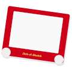
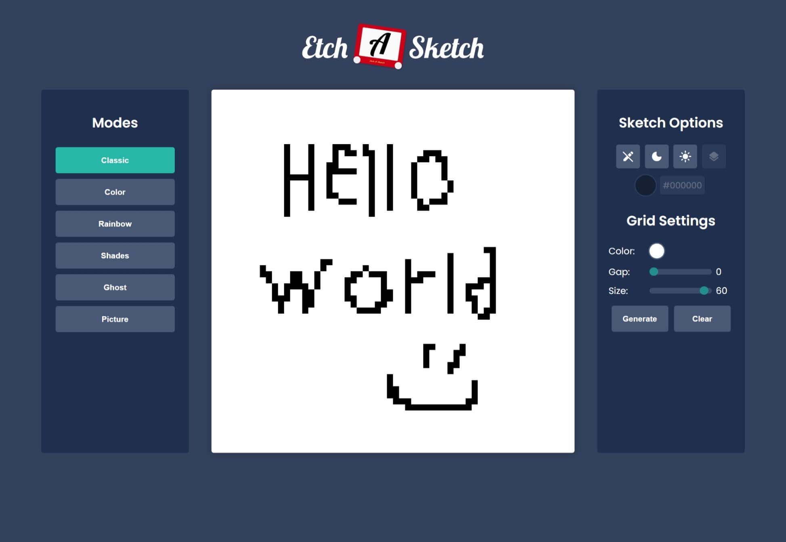

#  Etch-A-Sketch

[Live Demo](https://constPardalos.github.io/etch-a-sketch/)

## Description

An etch-a-sketch app with custom modes, sketch tools and grid options.

## Languages & Tools

The following were used for the creation of this project:

